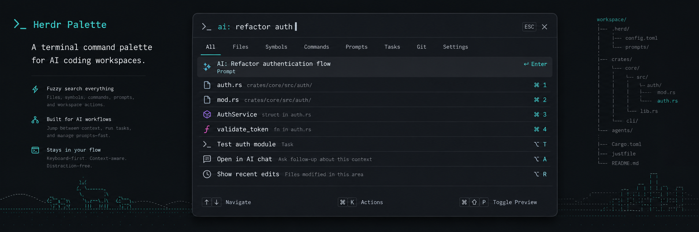

# Herdr Palette



[](https://crates.io/crates/herdr-palette)
[](https://docs.rs/herdr-palette)
[](https://github.com/ramarivera/herdr-palette/actions/workflows/ci.yml)
[](LICENSE)

A Raycast/Linear-style command palette for
[Herdr](https://github.com/ramarivera/herdr), the terminal workspace manager
for AI coding agents.

`prefix+space` opens a centered overlay that fuses every Herdr surface into one
palette: keybindings, plugin actions, custom commands, workspaces, tabs, and
agents. It defaults to a mnemonic tree view, toggles to a flat Raycast-style
list with `Ctrl-t`, and dispatches safe rows with Enter.

```text
┌ Herdr Palette · catppuccin ─────────────────────────┐
│View TREE   > split▏                                 │
│  ▾ Panes                                            │
│    ▾ Focus                                          │
│      • Previous pane  prefix+shift+tab  match       │
│    ▾ Layout                                         │
│      • Split vertical  prefix+v, prefix+|  match    │
│▶     • Split horizontal  prefix+minus  match        │
└─────────────────────────────────────────────────────┘
```

## What it does

The palette is a read layer over the live Herdr server. It collects:

| Source | How | Count |
| ------ | --- | ----- |
| Keybindings | `herdr-pretty-which` binding model | 49 |
| Plugin actions | `herdr plugin action list` | 2 |
| Custom commands | `[[keys.command]]` entries | 3 |
| Workspaces | `herdr workspace list` | 3 |
| Tabs | `herdr tab list` | 4 |
| Agents | `herdr agent list` | 4 |

Tree mode preserves mnemonic group context from `herdr-pretty-which`. Flat list
mode sorts by fuzzy score, dispatchability, source priority, then title.

### Dispatch tiers

- **Tier A — direct CLI:** safe create/focus/split/zoom actions and plugin
  actions with fully resolved `command[]` arrays.
- **Tier B — list + resolve + focus:** previous/next workspace, tab, and agent
  cycles. The palette reads the live ordered list, finds the focused row, then
  focuses the neighbor.
- **Reference-only:** rows that are keybinding-only or need a target/prompt the
  palette cannot provide safely yet. These render greyed and ignore Enter.

## Install

```bash
cargo install herdr-palette --locked
```

Herdr plugin support requires Herdr `>= 0.7.0`. After installing the binary,
link the cargo-installed manifest from this checkout:

```bash
herdr plugin link cargo
herdr plugin pane open --plugin ramarivera.palette --entrypoint overlay --placement overlay --focus
```

You can also install the GitHub-managed plugin checkout directly. Herdr will
build the release binary during install and run it from the managed checkout:

```bash
herdr plugin install ramarivera/herdr-palette
```

For local development only:

```bash
cargo build --release
cargo install --path . --locked
```

The published crate depends on `herdr-pretty-which` from crates.io. A sibling
checkout is only needed when developing both crates together.

## Run

```bash
# Interactive overlay, when stdout is a TTY.
herdr-palette

# Start the overlay directly in shell mode.
herdr-palette --shell

# Snapshot to stdout for tests/screenshots/non-TTY.
herdr-palette --snapshot --query "split" --width 100 --height 30

# Diagnose which sources are contributing items.
herdr-palette --debug-kinds

# Print occupied chords from all collected key sources.
herdr-palette --debug-keys
```

| Flag | Default | Purpose |
| ---- | ------- | ------- |
| `--config <PATH>` | `~/.config/herdr/config.toml` | Config to reflect |
| `--query <Q>` | `""` | Initial fuzzy query |
| `--shell` | off | Start directly in shell mode |
| `--snapshot` | off | Render once to stdout |
| `--width` / `--height` | `100` / `24` | Snapshot dimensions |
| `--debug-kinds` | off | Print item counts by source |
| `--debug-keys` | off | Print occupied chords |

## Keybindings inside the palette

| Key | Action |
| --- | ------ |
| `Enter` | Dispatch selected row |
| `↑` `↓` or `Ctrl-n` / `Ctrl-p` | Move selection |
| `Ctrl-t` | Toggle tree/list view |
| `←` / `→` | Collapse, expand, or enter tree groups |
| `Ctrl-[` / `Ctrl-]` | Collapse/expand all tree groups |
| `Esc` / `Ctrl-c` / `Ctrl-d` | Cancel |
| `Ctrl-u` | Clear query |
| typing | Append to query |

Shell mode runs a command with the login shell. When no shell command is
running, `Esc`, `Ctrl-c`, `Ctrl-d`, or empty `Enter` closes the plugin pane.

## Theming

Inherits your configured Herdr theme via `Palette::from_theme`: catppuccin,
tokyo-night, dracula, nord, gruvbox, one-dark, solarized, kanagawa, and custom
`[[theme.custom]]` overrides. The palette uses the same colors as
`herdr-pretty-which`, so it matches the rest of the Herdr UI.

## Herdr plugin manifest

`herdr-plugin.toml` declares the plugin so Herdr can discover and launch it:

```toml
id = "ramarivera.palette"

[[actions]]
id = "open"
title = "Open palette"
contexts = ["workspace", "tab", "pane", "global"]
command = [
  "herdr",
  "plugin",
  "pane",
  "open",
  "--plugin",
  "ramarivera.palette",
  "--entrypoint",
  "overlay",
  "--placement",
  "overlay",
  "--focus",
]
```

Bind it to a chord in your Herdr config:

```toml
[keys]
# e.g. open the palette with prefix+space
workspace_picker = "prefix+space"
```

## Architecture

```text
src/
├── main.rs      # CLI args and mode dispatch
├── source.rs    # collects sources into Vec<Item>
├── items.rs     # item constructors and tree metadata
├── dispatch.rs  # action-to-dispatch map and runner
└── tui.rs       # tree/list state, fuzzy filtering, render loop
```

The terminal restore path is guarded by drop guards, so a failure mid-loop never
leaves your terminal in raw mode.

## License

MIT
